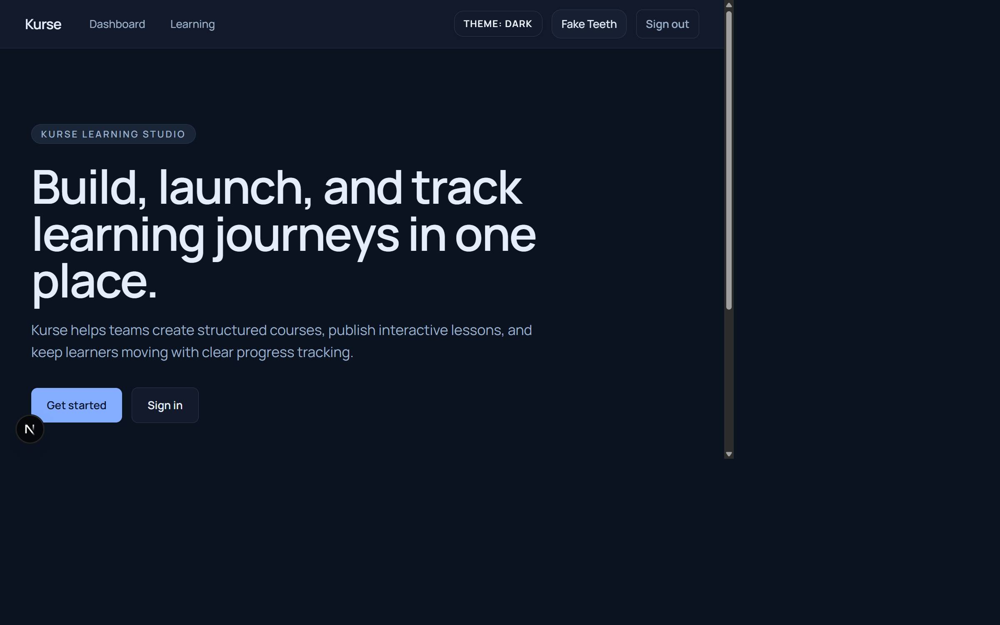
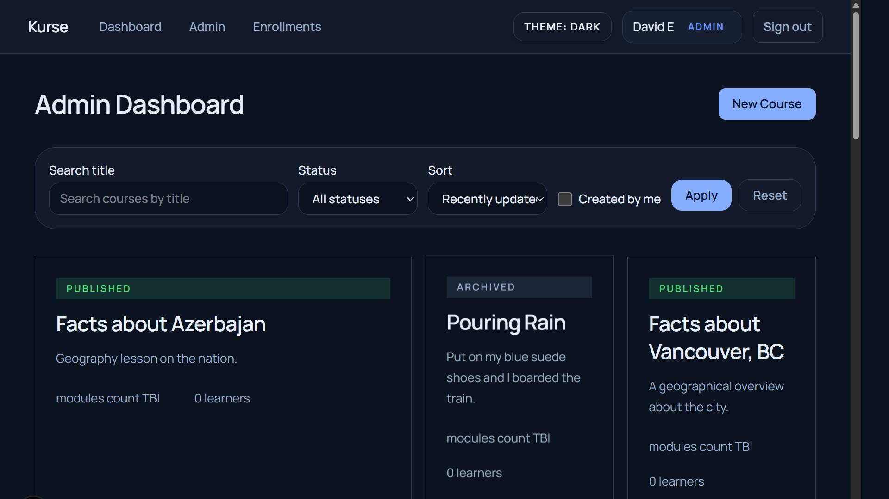
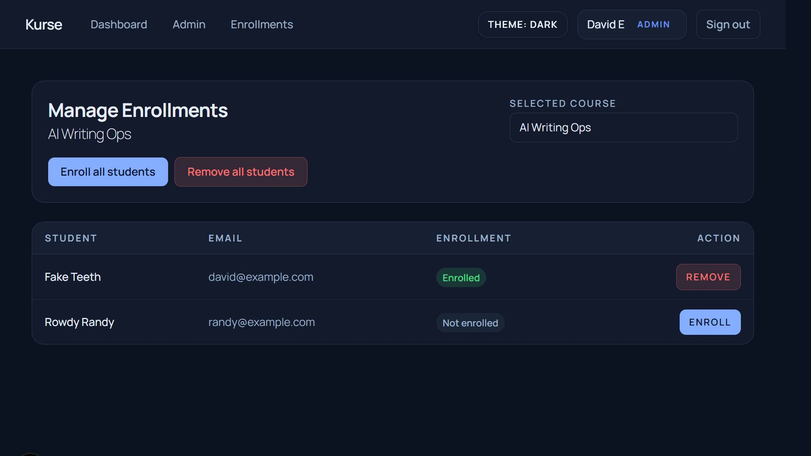
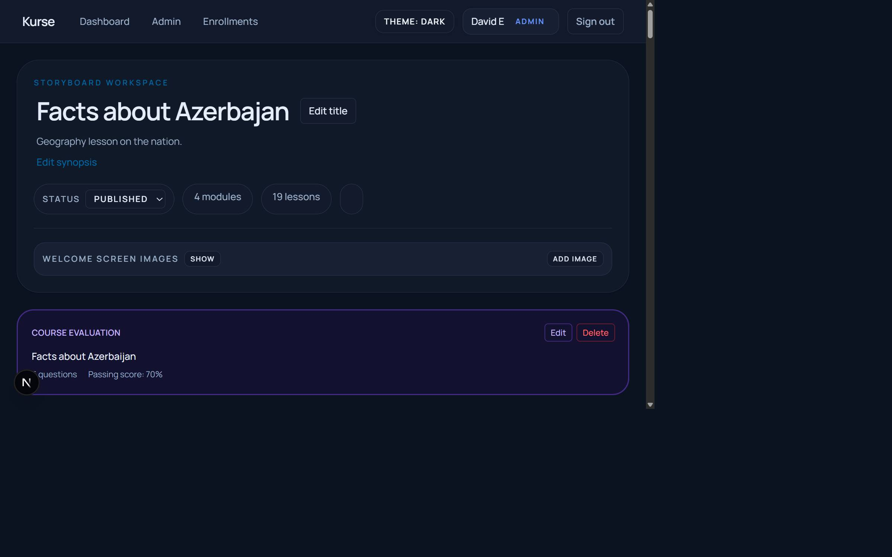
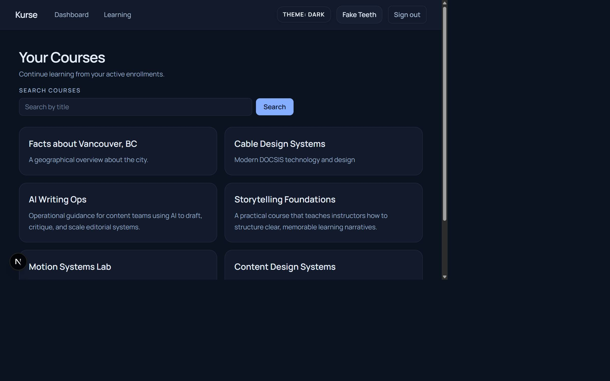
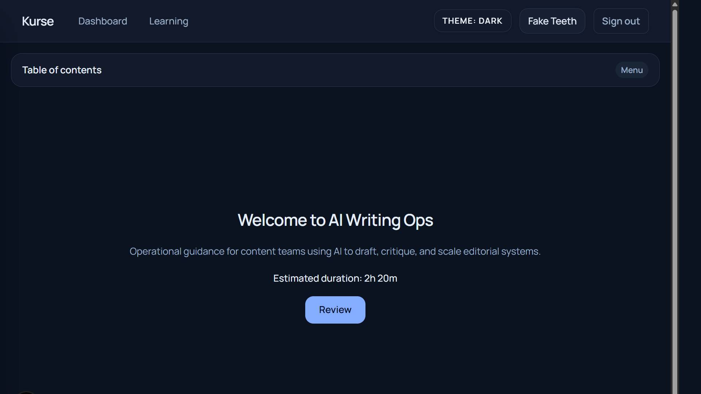

# Kurse

Kurse is a learning platform for creating, publishing, assigning, and running courses with a dedicated admin workflow and student learning experience.

## What You Can Do

- Build and maintain courses from the admin dashboard.
- Edit storyboard-based course structure and content.
- Manage enrollments by course.
- Let students browse enrolled courses and launch lessons.
- Run lesson/course experiences with progress tracking and evaluations.
- AI quiz generation for lessons (optional, requires Anthropic API key).

## Tech Stack

- Next.js 16 (App Router)
- React 19
- TypeScript
- Drizzle ORM + drizzle-kit
- Neon Postgres
- NextAuth
- Vitest
- Redis (optional, recommended for production-like workflows)

## Quick Start

1. Install dependencies:

```bash
npm install
```

2. Configure environment variables in `.env`:

```bash
DATABASE_URL=...
NEXT_AUTH_SECRET=...
ANTHROPIC_API_KEY=... # optional, required for AI quiz generation
REDIS_URL=...         # optional, recommended for production-like workflows
```

3. Start the app:

```bash
npm run dev
```

4. Open:

```text
http://localhost:3000
```

## Database Utilities

Seed or refresh sample course data:

```bash
npm run seed-courses
```

Verify the course trigger behavior:

```bash
npm run verify-course-trigger
```

## App Screenshots

### Public / Landing



### Admin Experience







### Student Experience





## AI Quiz Generation Rate Limits

- Cooldown: 20 seconds between requests.
- Hourly cap: 30 requests per user across all courses.
